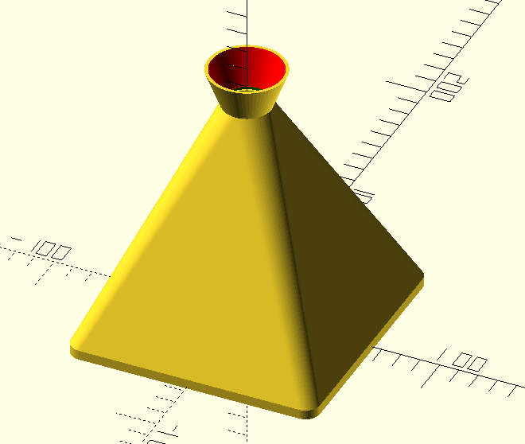
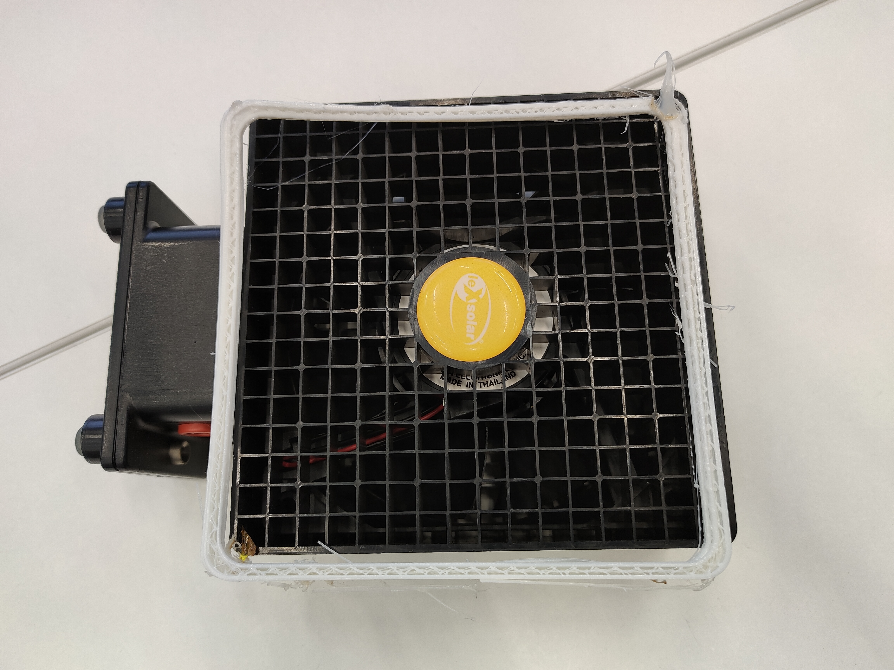

# Работа Газмагомадова Ислама
# Проект «Pong Levitation» на языке OpenScad

Модель для 3D печати сопла с чехлом  для вентилятора из экспериментального набора альтернативных источников энергии LeXsolar, которая используется для проведения физического опыта по левитации шарика от пинг-понга в потоке воздеху. Ускорение потока воздуха выполняется с помощью сопла Лаваля. 

### Фотография рамки с вентилятором
[Комлект для эксперимента]
(https://lexsolar.com/shop-en/product-information/1406_en) на официальном сайте leXsolar-Wind Professionaal

Фотографияраспечатанной тестовой модели:

